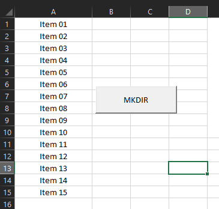
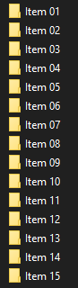
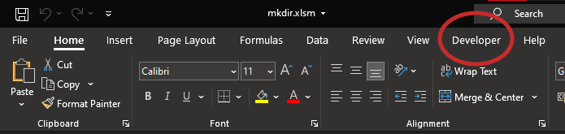
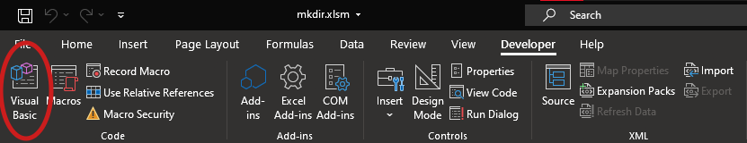
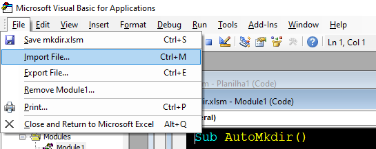
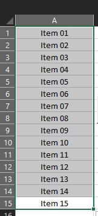
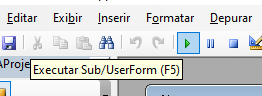
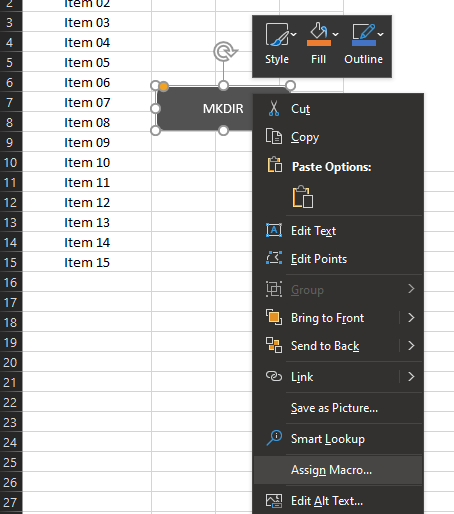
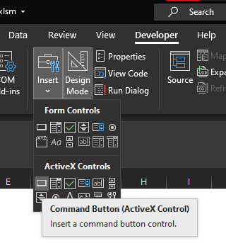

<h3 align="center"> 

</h3>

<h1 align="center">
   📁 <a href="#"> VBMKDIR </a>
</h1>

<h3 align="center">
    Script que automatiza a instrução mkdir
</h3>

<p align="center">
  
  
  
  
  <a href="https://github.com/vitoriape/vbmkdir/blob/mkdir.vb-vpa/LICENSE">
    
  </a>
  
  <a href="https://github.com/vitoriape/vbmkdir/commits/master">
    
  </a>
</p>

<h4 align="center"> 
	 Status: Concluído
</h4>

---

Index
=================
<!--ts-->
   * [Sobre](#sobre)
   * [Ferramentas](#ferramentas)
   * [Referências](#referências)
   * [Recursos](#recursos)
      * [Layout](#layout)
   * [Pré-requisitos](#pré-requisitos)
   * [Instalação](#instalação)
      * [Importando e Executando o Script no Excel](#importando-e-executando-o-script-no-excel)
      * [Trabalhando com Botões no Excel](#trbalhando-com-botões-no-excel)
   * [Time](#time)
 

## Sobre
Este projeto é um script feito em [VBA](https://docs.microsoft.com/pt-br/office/vba/library-reference/concepts/getting-started-with-vba-in-office) que cria pastas automaticamente a partir de células selecionadas no Excel.

---

## Ferramentas

O desenvolvimento desse modelo utiliza as seguintes ferramentas:

- [Git](https://git-scm.com/)
- [Excel](https://support.microsoft.com/en-us/excel)
- [Visual Basic for Applications](https://docs.microsoft.com/pt-br/office/vba/api/overview/excel)


## Referências

Para mais informações sobre o uso da instrução `Do (...) Loop` e da `MkDir`, além da função `Dir` no Visual Basic for Applications, leia a documentação da Microsoft:

- [Do...Loop Statement](https://docs.microsoft.com/en-us/office/vba/language/reference/user-interface-help/doloop-statement)
- [MkDir Statement](https://docs.microsoft.com/en-us/office/vba/language/reference/user-interface-help/mkdir-statement)
- [Dir Function](https://docs.microsoft.com/en-us/office/vba/language/reference/user-interface-help/dir-function)

## Recursos

- [x] Mkdir automático (script)
- [ ] Opção de usuário de pasta de destino
- [ ] Criação de subpasta a partir das colunas

### Layout

<table class="tg">
<thead>

  <tr>
    <th class="tg-c3ow">Células</th>
    <th class="tg-c3ow">Pastas</th>
  </tr>
</thead>
<tbody>
  <tr>
    <td class="tg-c3ow"><br></td>
    <td class="tg-c3ow"><br></td>
  </tr>
</tbody>
</table>

---

## Pré-requisitos

- [Microsoft Excel](https://www.microsoft.com/pt-br/microsoft-365/microsoft-office?ocid=oo_support_mix_marvel_ups_support_smcuhfoffice&rtc=1)
- [Guia Desenvolvedor do Excel Ativada](https://support.microsoft.com/en-us/topic/show-the-developer-tab-e1192344-5e56-4d45-931b-e5fd9bea2d45)

---

## Instalação

```cmd
# Clone este repository
$ git clone <https://github.com/vitoriape/vbmkdir>
```

### Importando e Executando o Script no Excel

* <b>1. Certifique-se de ter a guia desenvolvedor ativada:</b>




* <b>2. Abra o editor do VisualBasic:</b>




* <b>3. Importe o arquivo `mkfolder.bas`:</b>




* <b>4. Selecione as células com os nomes das pastas:</b>




* <b>5. Execute o script:</b>



>**Dê uma olhada na seção [Working with Buttons](#trabalhando-com-botões-no-excel) para uma melhor experiência**

* <b>6. As pastas serão criadas automaticamente:</b>


### Trabalhando com Botões no Excel 
No Excel, você pode executar um script (macro) usando um [botão de controle de formulário ou um botão de comando](https://support.microsoft.com/pt-br/office/atribuir-uma-macro-a-um-bot%C3%A3o-formul%C3%A1rio-ou-controle-d58edd7d-cb04-4964-bead-9c72c843a283), ou então usando [formas](https://answers.microsoft.com/en-us/msoffice/forum/all/assigning-macros-to-shapes/a84b07b2-bc92-4034-8327-024799aa529c#:~:text=Right%2DClick%20on%20the%20shape,shape%2C%20the%20macro%20will%20run).

- Usando Formas



- Usando Botões

**1. Acesse a guia Desenvolvedor e crie um `Botão de Comando`:**



**2. Renomeie o mesmo se quiser e clique duas vezes no botão:**


**3. Você verá uma estrutura de `Private Sub` parecida com a seguinte:**

```vba
Private Sub CommandButton1_Click()

End Sub
```

**4. Você pode alterar o nome da `Sub`. Em seguida, altere o comando `Click` para  `OnClick`:**

```vba
Private Sub MkDirButton_OnClick()

End Sub
```

**5. Copie e cole o script `mkfolders.bas`:**

```vba
Private Sub MkDirButton_OnClick()
      Dim folders As Range 
      Dim maxRows, maxColumns, rw, cs As Integer
    
    
      Set folders = Selection 
        
        maxRows = folders.rows.Count
        maxColumns = folders.columns.Count
   
      For cs = 1 To maxColumns  
      rw = 1
        
      Do While rw <= maxRows 
        If Len(Dir(ActiveWorkbook.Path & "\" & folders(rw, cs), vbDirectory)) = 0 Then
            MkDir (ActiveWorkbook.Path & "\" & folders(rw, cs))
        
            On Error Resume Next
            
        End If  
    
      rw = rw + 1  '< Loop of rows >
    
      Loop
      Next cs

      MsgBox "Folders created successfully!", vbOKOnly, "Console"
End Sub
```

**6. Feche o  `VisualBasic`. Selecione as células e execute o script clicando no seu novo botão!**

---

## Time
### Autor
<table>
  <tr>
    <td align="center"><a href="https://github.com/vitoriape"><br /><sub><b>Vitória Peçanha</b></sub></a></td> 
</table>

### License

This project is under the   
<a href="https://github.com/vitoriape/vbmkdir/blob/master/LICENSE">
    
</a>
