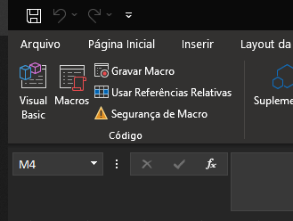
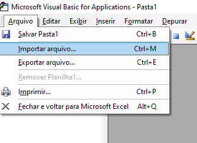
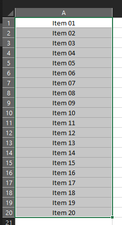
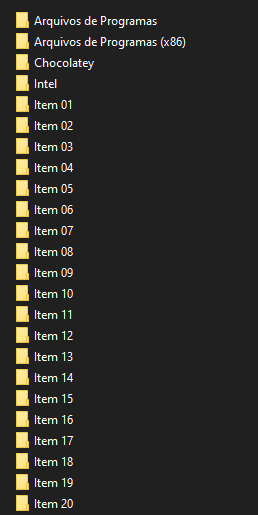

<h3 align="center"> 

</h3>

<p align="center">
  
  
  
  
  <a href="https://github.com/vitoriape/vbmkdir/blob/mkdir.vb-vpa/LICENSE">
    
  </a>
  
  <a href="https://github.com/vitoriape/vbmkdir/commits/master">
    
  </a>
</p>

---

Index
=================
<!--ts-->
   * [About](#about)
   * [Tools](#tools)
   * [References](#references)
   * [Setup](#setup)
   * [Author](#author)
 

### About

> [Versão em Português (pt-br)](https://github.com/vitoriape/vbmkdir/blob/master/LEIAME.md). 

This project is an [VBA](https://docs.microsoft.com/pt-br/office/vba/library-reference/concepts/getting-started-with-vba-in-office) script for create folders automatically from sellected cells on Excel.


### Tools

Development of this script utilizes the tools listed below:

- [Git](https://git-scm.com/)
- [Excel](https://support.microsoft.com/en-us/excel)
- [Visual Basic for Applications](https://docs.microsoft.com/pt-br/office/vba/api/overview/excel)


### References

For more information about using the statement `Do (...) Loop` and statement `MkDir`, besides the function `Dir` on Visual Basic for Applications, read the Microsoft documentation:

- [Do...Loop Statement](https://docs.microsoft.com/en-us/office/vba/language/reference/user-interface-help/doloop-statement)
- [MkDir Statement](https://docs.microsoft.com/en-us/office/vba/language/reference/user-interface-help/mkdir-statement)
- [Dir Function](https://docs.microsoft.com/en-us/office/vba/language/reference/user-interface-help/dir-function)


### Setup

```cmd
# Clone this repository
$ git clone <https://github.com/vitoriape/vbmkdir>
```

* <b>1. Make sure you have the developer guide activated:</b>


* <b>2. Open the VisualBasic editor:</b>




* <b>3. Import the file makefolder.bas:</b>




* <b>4. Select cells with folder names:</b>




* <b>5. Run the script:</b>


>**Insert a button on your spreadsheet and assign the macro `makefolder.bas`**
>>**This way you can run the script only clicking the button**


* <b>6. Folders will be created automatically:</b>



---

### Author

<table>
  <tr>
    <td align="center"><a href="https://github.com/vitoriape"><br /><sub><b>Vitória Peçanha</b></sub></a></td> 
</table>
