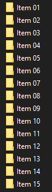
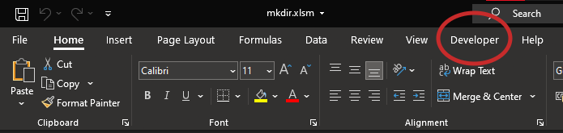
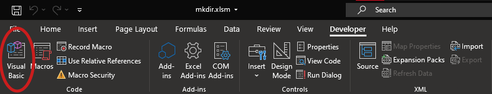
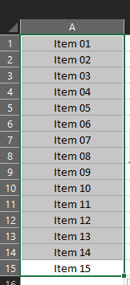
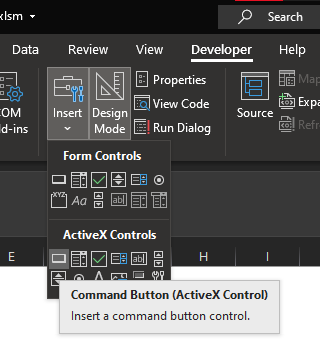

<h3 align="center"> 

</h3>

<h1 align="center">
   📁 <a href="#"> VBMKDIR </a>
</h1>

<h3 align="center">
    Script that automate mkdir statement
</h3>

<p align="center">
  
  
  
  
  <a href="https://github.com/vitoriape/vbmkdir/blob/mkdir.vb-vpa/LICENSE">
    
  </a>
  
  <a href="https://github.com/vitoriape/vbmkdir/commits/master">
    
  </a>
</p>

<h4 align="center"> 
	 Status: Finished
</h4>

---

Index
=================
<!--ts-->
   * [About](#about)
   * [Tools](#tools)
   * [References](#references)
   * [Features](#features)
      * [Layout](#layout)
   * [Pre-requisites](#pre-requisites)
   * [Setup](#setup)
      * [Import and Run Script on Excel](#import-and-run-script-on-excel)
      * [Working with Buttons on Excel](#working-with-buttons-on-excel)
   * [Team](#team)
 

## About
This project is an [VBA](https://docs.microsoft.com/pt-br/office/vba/library-reference/concepts/getting-started-with-vba-in-office) script for create folders automatically from sellected cells on Excel.

>[README em Português (pt-br)](https://github.com/vitoriape/vbmkdir/blob/master/LEIAME.md). 

---

## Tools

Development of this script utilizes the tools listed below:

- [Git](https://git-scm.com/)
- [Excel](https://support.microsoft.com/en-us/excel)
- [Visual Basic for Applications](https://docs.microsoft.com/pt-br/office/vba/api/overview/excel)


## References

For more information about using the statement `Do (...) Loop` and statement `MkDir`, besides the function `Dir` on Visual Basic for Applications, read the Microsoft documentation:

- [Do...Loop Statement](https://docs.microsoft.com/en-us/office/vba/language/reference/user-interface-help/doloop-statement)
- [MkDir Statement](https://docs.microsoft.com/en-us/office/vba/language/reference/user-interface-help/mkdir-statement)
- [Dir Function](https://docs.microsoft.com/en-us/office/vba/language/reference/user-interface-help/dir-function)

## Features

- [x] Automatic mkdir (script)
- [ ] User choice option for destination folder
- [ ] Subfolder creation from columns

### Layout

<table class="tg">
<thead>

  <tr>
    <th class="tg-c3ow">Cells</th>
    <th class="tg-c3ow">Folders</th>
  </tr>
</thead>
<tbody>
  <tr>
    <td class="tg-c3ow"><br></td>
    <td class="tg-c3ow"><br></td>
  </tr>
</tbody>
</table>

---

## Pre-requisites

- [Microsoft Excel](https://www.microsoft.com/pt-br/microsoft-365/microsoft-office?ocid=oo_support_mix_marvel_ups_support_smcuhfoffice&rtc=1)
- [Excel Developer Guide Activated](https://support.microsoft.com/en-us/topic/show-the-developer-tab-e1192344-5e56-4d45-931b-e5fd9bea2d45)

---

## Setup

```cmd
# Clone this repository
$ git clone <https://github.com/vitoriape/vbmkdir>
```

### Import and Run Script on Excel

* <b>1. Make sure you have the developer guide activated:</b>




* <b>2. Open the VisualBasic editor:</b>




* <b>3. Import the file makefolder.bas:</b>


* <b>4. Select cells with folder names:</b>




* <b>5. Run the script:</b>


>**Check the section [Working with Buttons]() for a better experience**

* <b>6. Folders will be created automatically:</b>


### Working with Buttons on Excel
On Excel, you can run a script (macro) using a [form control button or a command button](https://support.microsoft.com/en-us/office/assign-a-macro-to-a-form-or-a-control-button-d58edd7d-cb04-4964-bead-9c72c843a283), or using [shapes](https://answers.microsoft.com/en-us/msoffice/forum/all/assigning-macros-to-shapes/a84b07b2-bc92-4034-8327-024799aa529c#:~:text=Right%2DClick%20on%20the%20shape,shape%2C%20the%20macro%20will%20run).

- Using Shapes


- Using Buttons

**1. Access the Developer guide and create a `Command Button`:**



**2. Rename it with you want to and double click on the button:**


**3. You will see a structure of Private Sub similar to the following:**

```vba
Private Sub CommandButton1_Click()

End Sub
```

**4. You can rename the Sub. Next, change the command `Click` to  `OnClick`:**

```vba
Private Sub MkDirButton_OnClick()

End Sub
```

**5. Copy and paste the `mkfolders.bas` script:**

```vba
Private Sub MkDirButton_OnClick()
      Dim folders As Range 
      Dim maxRows, maxColumns, rw, cs As Integer
    
    
      Set folders = Selection 
        
        maxRows = folders.rows.Count
        maxColumns = folders.columns.Count
   
      For cs = 1 To maxColumns  
      rw = 1
        
      Do While rw <= maxRows 
        If Len(Dir(ActiveWorkbook.Path & "\" & folders(rw, cs), vbDirectory)) = 0 Then
            MkDir (ActiveWorkbook.Path & "\" & folders(rw, cs))
        
            On Error Resume Next
            
        End If  
    
      rw = rw + 1  '< Loop of rows >
    
      Loop
      Next cs

      MsgBox "Folders created successfully!", vbOKOnly, "Console"
End Sub
```

**6. Close the Visual Basic tab. Select the cells and run the script by clicking on your new button!**


---

## Team
### Author
<table>
  <tr>
    <td align="center"><a href="https://github.com/vitoriape"><br /><sub><b>Vitória Peçanha</b></sub></a></td> 
</table>

### License

This project is under the   
<a href="https://github.com/vitoriape/vbmkdir/blob/master/LICENSE">
    
</a>
